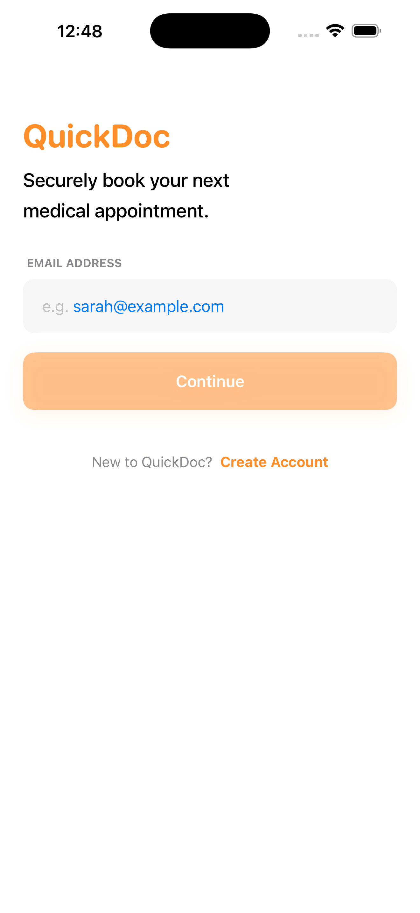
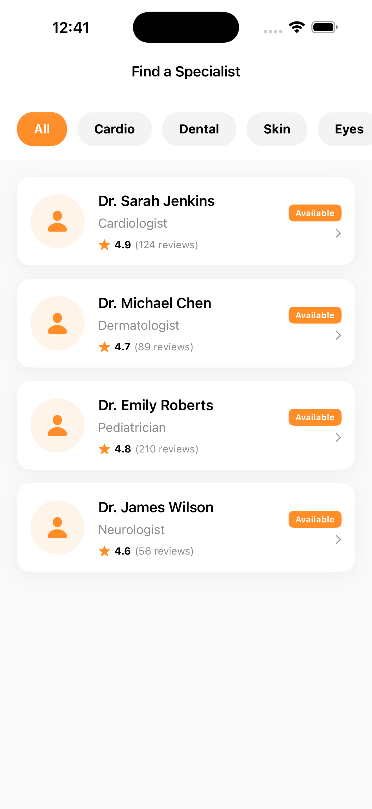
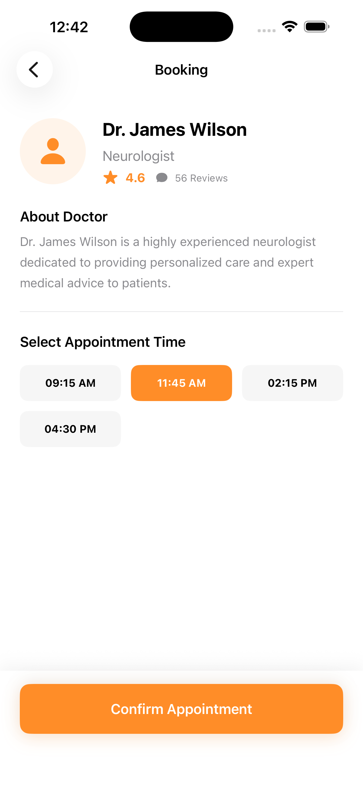
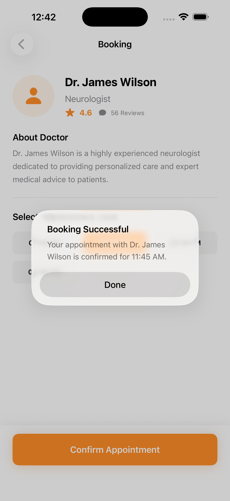

# QUICKDOC

<p align="center">
  <b>Book medical appointments in seconds.</b><br>
  A clean SwiftUI demo app focused on a simple, modern appointment-booking experience.
</p>

<p align="center">
  
  
  
</p>

## Overview

QUICKDOC is a lightweight iOS prototype that simulates a healthcare booking journey:

1. Login with email
2. Browse doctors
3. Open a doctor profile and choose a time slot
4. Confirm appointment and see success feedback

The app is intentionally minimal, UI-first, and powered by local mock data.

## What QUICKDOC Does

- Provides a clean login entry screen (email required to continue)
- Shows a scrollable list of doctors with rating and review count
- Lets users view doctor details and available time slots
- Enables selecting a slot and confirming an appointment
- Displays a success alert after booking confirmation
- Uses SwiftUI Navigation flow: Login -> Doctor List -> Booking

## What QUICKDOC Does Not Do (Yet)

- No real authentication (email is not verified against a backend)
- No API integration or server-side data
- No persistent storage for users, bookings, or history
- No payments, prescriptions, chat, or teleconsultation
- No calendar sync or notifications
- Category chips are currently visual; doctor list is not filtered by category logic

## Tech Stack

- Swift
- SwiftUI
- Local in-memory mock data (`MockData.swift`)
- MV-style separation using focused views and model structs

## Project Structure

```
QUICKDOC/
├── QUICKDOCApp.swift       # App entry point (starts at LoginView)
├── LoginView.swift         # Email login screen
├── DoctorListView.swift    # Specialist list screen
├── BookingView.swift       # Doctor details + slot booking
├── Doctor.swift            # Doctor data model
├── MockData.swift          # Local sample doctor data
├── ContentView.swift       # Default template view (currently unused)
└── SCREENSHOTS/
    ├── LOGIN.png
    ├── DOCTOR_LIST.png
    ├── doctor_appointment.png
    └── Appointement_Succesfull.png
```

## Working Flow (With Screenshots)

### 1) Login

User enters an email and taps **Continue**.



### 2) Doctor List

User browses available specialists and selects a doctor card.



### 3) Doctor Appointment Screen

User views doctor details, selects an available time slot, and taps **Confirm Appointment**.



### 4) Appointment Successful

App shows a booking success alert confirming selected doctor and time.



## How to Run

1. Open the project in Xcode.
2. Select an iOS Simulator (or a physical iOS device).
3. Build and run.
4. Start from the login screen and follow the booking flow.

## Roadmap Ideas

- Add real authentication and secure session handling
- Connect to a backend API for doctors and appointments
- Save bookings and user profile locally/remotely
- Implement category-based filtering and search
- Add appointment history, reminders, and push notifications

## Notes

This repository is a product-style prototype designed to demonstrate flow and UI quality, not a production-ready medical system.